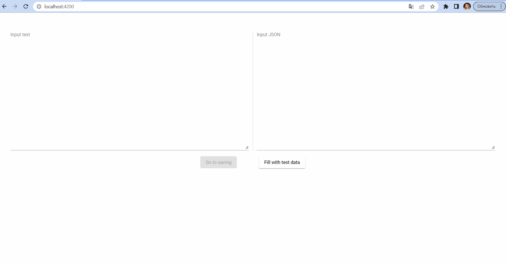

# JsonHW

This project was generated with [Angular CLI](https://github.com/angular/angular-cli) version 11.2.2.

## Running the example
1. npm install
2. ng server

Run `ng serve` for a dev server. Navigate to `http://localhost:4200/`. The app will automatically reload if you change any of the source files.

## Demo

